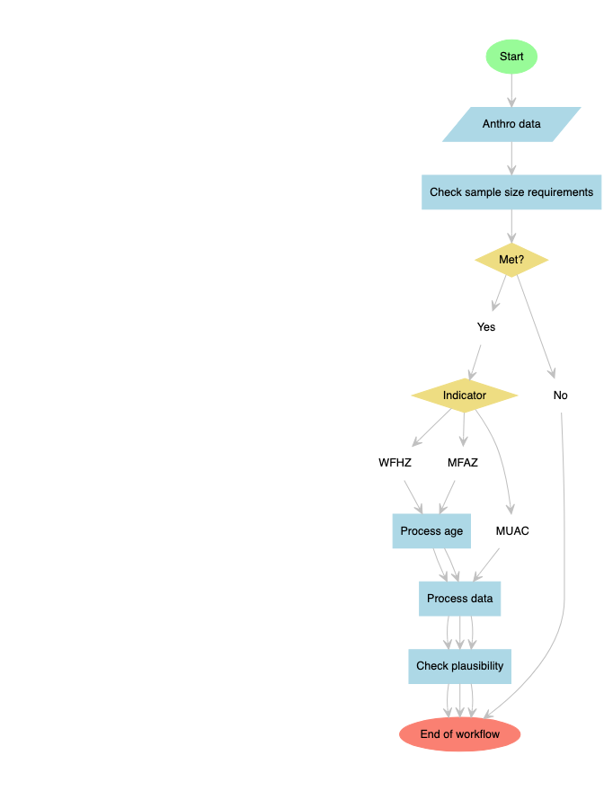

<!-- README.md is generated from README.Rmd. Please edit that file -->

# `ipccheckr`:Toolkit for Performing IPC Acute Malnutrition-related Data Checks

<!-- badges: start -->

[](https://github.com/tomaszaba/ipccheckr/actions/workflows/R-CMD-check.yaml)
[](https://app.codecov.io/gh/tomaszaba/ipccheckr?branch=main)
<!-- badges: end -->


## Background

IPC AMN is a global tool that uses a set o protocols to classify
geographical areas into a 5-phases severity based on the prevalence of
acute malnutrition among children aged 6:59 months. Its main objective
is to provide actionable information for decision-makers. It is not a
data collection method *per se*, therefore, it relies on evidence
generated through other methods (representative surveys, screening,
sentinel sites, etc). Before any evidence is used an IPC AMN analysis,
checks must performed to ascertain the quality of data, following the
minimum quality standards set in the protocol, hence its reliability. As
such, only evidence that pass the checks are allowed to be used in an
IPC analysis exercise.

## Why `ipccheckr`?

The typical analysis workflow is overly complex, tiring and tedious,
time-consuming and not not reproducible. Oftentimes, due to demand, the
workflow needs to be implemented on a pile of data in absolute short
time, making the process prone to human errors due to fatigue. In the
workflow, data “checker” needs to travel from software to software as
follows: SPSS software (mostly) to process data and export to Excel or
CSV to then import it into Emergency Nutrition Assessments (ENA) for
SMART software for to run the quality. From this stage downstream, the
workflow needs to be done one-by-one for the number of survey area a
data set may hold: run the quality check, then transfer the summary
results into a summary table (Excel spreadsheet or other). Then, run the
prevalence analysis (also one-by-one), and then transfer the results
into a spreadsheet and so on and so forth. Sometimes, a fourth tool is
used to correct for a likely overestimation of acute malnutrition
prevalence based on MUAC when there are excess of younger children (6:23
months) over older children (24:59 months) in the sample. Therefore, the
`ipccheckr` was developed simply to make the workflow simpler, joyful
and reproducible thanks to its array of handy functions.

## What does `ipccheckr` do?

In a nutshell, the array of exported functions span from sample size
checkers, data processors, quality checkers, prevalence calculators as
well as some handy functions to render formatted and presentable output
tables on the two latter groups of functions.

### Plausibility checks with `ipccheckr`

You can run plausibility checks on:

- Weight-for-height z-score (WFHZ) data
- MUAC-for-age z-score (MFAZ) data *when **age** variable **is**
  available*
- Absolute values of MUAC data *when **age** variable **is not**
  available*

#### Useful workflow with `ipccheckr` for data quality check

<!-- -->

### On the prevalence analysis

After the data quality checks workflow, you will now be in position to
decide whether or not you can proceed to the prevalence analysis. The
workflow is quite simple: you use the data returned by the data
processors in the above workflow. `ipccheckr` can compute acute
malnutrition prevalence based on:

- WFHZ and/or edema - guide
- MUAC and/or edema - guide
- Combined prevalence (of WFHZ and MUAC and edema) - guide
- MFAZ and/or edema - guide

<style>
.callout-tip {
  border-left: 4px solid #2ECC71; /* Green border */
  background-color: #EAFAF1; /* Light green background */
  padding: 10px;
  margin: 20px 0;
  border-radius: 10px;
}
</style>

<div class="callout-tip">

<strong>💡 Tip </strong>

Despite the fact that this package was designed with the idea of
simplifying the IPC AMN checks workflow in mind, you can absolutely use
its utilities beyond this scope. For instance, if you are undertaking a
research and you want to censor your data before including in your
statistical models, etc, you can use this packages utilities for that.

</div>

<style>
.callout-warning {
  border-left: 4px solid #FF4500; /* Red border */
  background-color: #FDEDEC; /* Light red background */
  padding: 10px;
  margin: 20px 0;
  border-radius: 10px;
}
</style>

<div class="callout-warning">

<strong>⚠️ Warning</strong>

Please note that `ipccheckr` is still highly experimental and is
undergoing a lot of development. Hence, any functionalities described
below have a high likelihood of changing interface or approach as we aim
for a stable working version.

</div>

## Installation

`ipccheckr` is not yet on CRAN but you can install the development
version from [GitHub](https://github.com/) with:

``` r
# install.packages("devtools")
devtools::install_github("tomaszaba/ipccheckr")
```

Then load to in memory with

``` r
library(ipccheckr)
```

# Citation

If you were enticed to using `ipccheckr` package and found it useful,
please cite using the suggested citation provided by a call to
`citation` function as follows:

``` r
citation("ipccheckr")
#> To cite ipccheckr: in publications use:
#> 
#>   Tomás Zaba, Ernest Guevarra (2024). _ipccheckr: Toolkit for
#>   Performing IPC Acute Malnutrition-related Data Checks_. R package
#>   version 0.0.0.9000, <https://github.com/tomaszaba/ipccheckr>.
#> 
#> A BibTeX entry for LaTeX users is
#> 
#>   @Manual{,
#>     title = {ipccheckr: Toolkit for Performing IPC Acute Malnutrition-related Data Checks},
#>     author = {{Tomás Zaba} and {Ernest Guevarra}},
#>     year = {2024},
#>     note = {R package version 0.0.0.9000},
#>     url = {https://github.com/tomaszaba/ipccheckr},
#>   }
```
